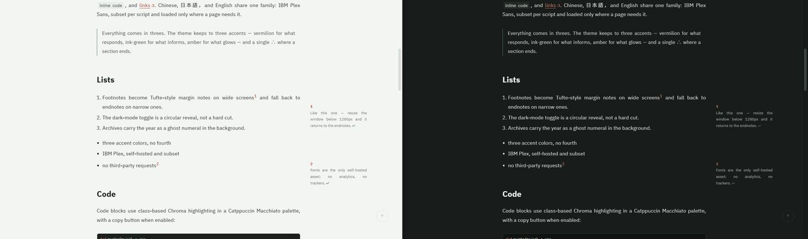

# hugo-theme-sigil

**English** | [中文](README.zh.md) | [日本語](README.ja.md)

<p>
  
  
  
</p>

A restrained literary theme for [Hugo](https://gohugo.io/), based on
[PaperMod](https://github.com/adityatelange/hugo-PaperMod).

Demo: <https://ouatis.com/hugo-theme-sigil/>



**Requires [Hugo Extended](https://gohugo.io/installation/) ≥ 0.166.0**
(the theme uses `images.Text` for OG cards, which needs the extended build).

> The version badge above reflects the latest **tagged release**; the
> [CHANGELOG](CHANGELOG.md) tracks every change up to the current `main`.

## Features

- Tufte-style sidenotes on wide screens, endnotes on narrow screens
- Ghost-year archive index
- Circular-reveal dark-mode toggle
- Full-text RSS
- IBM Plex typography with CJK font subsetting
- JSON Feed 1.1 (`/feed.json`, alongside RSS, generated at build)
- Search, taxonomies, breadcrumbs, TOC, code-copy buttons, and multilingual strings
- Opt-in per page: KaTeX math (vendored), Mermaid diagrams (pinned CDN), image lightbox (glightbox, vendored)
- Auto-generated OG card images from post titles (`images.Text`, build-time only)
- External links marked with a door glyph via a render hook (host-aware, no hardcoded domains)
- `llms.txt` (and optional `llms-full.txt`) — a machine-readable site index for AI agents
- Maintainers and agents: see [AGENTS.md](AGENTS.md) for build/verify commands and pitfalls; `scripts/check.sh` is the one-shot verification

## Install

As a git submodule:

```bash
git submodule add https://github.com/ouatis/hugo-theme-sigil themes/hugo-theme-sigil
```

```toml
# hugo.toml
theme = "hugo-theme-sigil"
```

Or as a [Hugo module](https://gohugo.io/hugo-modules/):

```bash
hugo mod init github.com/you/your-site   # skip if the site already has go.mod
```

```toml
# hugo.toml
[module]
  [[module.imports]]
    path = "github.com/ouatis/hugo-theme-sigil"
```

Preview the example site:

```bash
git clone https://github.com/ouatis/hugo-theme-sigil
cd hugo-theme-sigil/exampleSite
hugo server --themesDir ../..
```

## Configuration

Common PaperMod options work as usual. Sigil-specific options:

| Parameter | Default | Purpose |
| --- | --- | --- |
| `sgKicker` | hidden | Text above the homepage title |
| `sgHomeTitle` | site title | Homepage title |
| `sgReading` / `sgListening` / `sgWatching` / `sgPlaying` / `sgWriting` / `sgExploring` / `sgMotto` | hidden | Homepage status line |
| `sgSealImage` | `∴` | Homepage seal image |
| `sgDaysInCage` | `false` | Status line day counter — "Day N in the Cage", counted from the earliest post |
| `ShowFullTextinRSS` | `false` | Include full articles in RSS |
| `ShowAllPagesInArchive` | `false` | Include all pages in archives |
| `homePageSize` | all | Homepage posts per page |
| `sgSeriesFrom` | hidden | Series navigation: points to a curation page whose body list defines the reading order; `sgSeriesTab` sets the tab label |
| `math` / `mermaid` / `lightbox` | `false` | Opt-in per page (frontmatter) or site-wide: KaTeX math, Mermaid diagrams, image lightbox. Nothing loads on pages that don't ask. `$$…$$` works out of the box; for inline `\(…\)` also enable goldmark passthrough as in [exampleSite/hugo.toml](exampleSite/hugo.toml) |
| `ogAutoCard` | `false` | Build-time 1200×630 OG card (title + site name on paper, ∴ mark) for pages without any cover/image |
| `ogCardFont` | built-in Plex Serif | `resources.Get` path to a TTF for OG cards. The bundled Latin font cannot draw CJK — CJK sites should subset a TTF for their titles and point this at it |
| `analytics.*` | hidden | Third-party stats, production only: `analytics.plausible.domain`, `analytics.umami` (`src` + `id`), `analytics.goatcounter.code`, `analytics.fathom.site` |
| `llmsTxtIntro` | hidden | Optional one-paragraph introduction inside `llms.txt` |

### Agent-readable output (llms.txt)

Add `LLMSTXT` (an index of pages and posts) and optionally `LLMSFULL` (the
same header, then every post's full text) to the home outputs:

```toml
[outputs]
  home = ["HTML", "RSS", "JSONFeed", "LLMSTXT", "LLMSFULL"]
```

The key pages section detects About / Archives / taxonomies / RSS
automatically; override `layouts/home.llmstxt.txt` to curate it.

Frequently used inherited options include `defaultTheme`, `ShowToc`,
`TocOpen`, `ShowCodeCopyButtons`, `ShowBreadCrumbs`, `ShowReadingTime`,
`ShowWordCount`, `ShowPostNavLinks`, `showRelated`, and `socialIcons`.

See [exampleSite/hugo.toml](exampleSite/hugo.toml) for a complete example.

## Fonts

Font subsets (optional — the theme ships Latin and works out of the box):

```bash
bash scripts/build-fonts.sh corpus   # or latin / full
```

- `latin` — Latin only; the bootstrap subset already committed to the repo
  (CJK text falls back to system fonts). This is the clean-checkout default.
- `corpus` — additionally scans the example site's own characters and subsets
  a small SC corpus so the demo's CJK renders in real Plex (~30 KB). **Shell
  script only** — `scripts/build-fonts.py` covers `latin`/`full` but not
  `corpus`.
- `full` — official SC + JP split shards (for CJK/JP sites that want full
  coverage; ~3 MB on a text-heavy page)

## Performance

Measured on the example site, minified build:

- Homepage: ~78 KB total — 16 KB HTML + 57 KB CSS + 5 KB inline JS, **zero external JavaScript**
- Optional, opt-in only: search script 18 KB (search page), KaTeX 332 KB (`math = true`), GLightbox 56 KB (`lightbox = true`)
- Fonts: the demo runs the `corpus` pipeline, so its CJK renders in real Plex — ~104 KB first visit on a text-heavy page (Latin subsets + a small SC corpus). A `latin`-only site is ~85 KB (CJK falls back to system fonts). Sites needing full CJK/JP coverage run `full` (~3 MB, one file cached site-wide, `font-display: swap` covers the wait)
- No frameworks, no jQuery, no runtime CDN dependencies

## Stability

The public contract — parameter names, `sg-*` classes, output formats, data
shapes, extension partials — is **frozen as of v0.9.0**: renames require a
deprecation window and removals wait for a major release. The full contract
and deprecation policy live in [docs/api.md](docs/api.md). Both install modes
(submodule and Hugo module) are exercised in CI.

## Translations

The 47 bundled languages are largely machine-completed. Fixes from native
speakers are very welcome — open an issue or a PR touching `i18n/*.yaml`
only; new keys land in `en` first and fall back everywhere else.

## License

MIT. See [LICENSE](LICENSE).

Based on PaperMod. Fonts: IBM Plex, SIL OFL 1.1. Icons: Phosphor Icons, MIT.
Search: Fuse.js, Apache-2.0. Math: KaTeX, MIT (vendored). Lightbox: glightbox,
MIT (vendored). Diagrams: Mermaid, MIT (loaded from a pinned CDN on pages that
ask for it).
