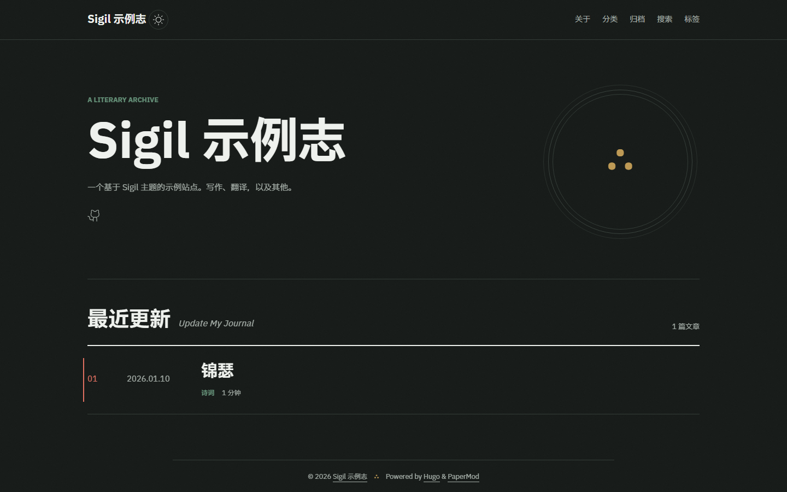

# hugo-theme-sigil

[English](README.md) | 中文 | [日本語](README.ja.md)

一个简约的 Hugo 博客主题：旧纸底色、朱砂·墨绿·琥珀三色排印、Tufte 式边注、
全文 RSS 与按内容切片的字体子集管线。基于 [PaperMod](https://github.com/adityatelange/hugo-PaperMod)（MIT）深度定制。

**[在线演示](https://ouatis.com/hugo-theme-sigil/)**



## 快速开始

```bash
git clone https://github.com/ouatis/hugo-theme-sigil
cd hugo-theme-sigil/exampleSite
hugo server --themesDir ../..
```

在自己的站点使用：

```bash
git clone https://github.com/ouatis/hugo-theme-sigil themes/hugo-theme-sigil
# hugo.toml: theme = "hugo-theme-sigil"
```

部署前把 `baseURL` 改成自己的域名（示例站默认 `https://example.com/`）。

## 配置

| 参数 | 说明 | 默认 |
| --- | --- | --- |
| `params.sgKicker` | 首页标题上方的小字 | 不显示 |
| `params.sgReading` / `params.sgPlaying` / `params.sgMotto` | Hero 印章下方的轮换状态 | 不显示 |
| `params.sgSealImage` | 首页徽记图片，不设则显示 ∴ 字形印章 | ∴ 字形 |
| `params.mainSections` | 首页列表与 RSS 的内容区段 | `["posts"]` |
| `params.author` | 文章署名（RSS 与文章 meta） | 不显示 |

完整示例见 [exampleSite/hugo.toml](exampleSite/hugo.toml)。示例站内容为英文；主题内置 zh-CN / en / ja 文案。

## 字体与边注

首次构建前运行：

```bash
pip install "fonttools[woff]"
scripts/build-fonts.sh
```

脚本按站内用字生成 unicode-range 切片的 woff2 分片，读者首访按需下载几 KB；未运行则回退系统字体。脚注在宽屏（≥1280px）呈现在引注右侧的边距里（Tufte 式），窄屏自动回退文末。

## 许可

MIT — 见 [LICENSE](LICENSE)。基于 [PaperMod](https://github.com/adityatelange/hugo-PaperMod)；字体 [IBM Plex](https://github.com/IBM/plex)（IBM 开源字体许可）；图标 [Phosphor Icons](https://phosphoricons.com/)（MIT）。
