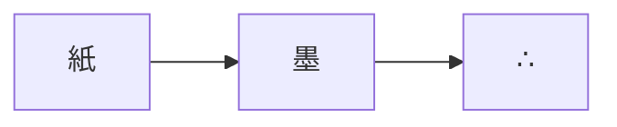

Sigil はすべて三つ組：朱は応答、墨绿は情報、琥珀は輝き、
段落の終わりに ∴ を置く。中文・日本語・English は IBM Plex Sans を共用し、
脚本ごとにサブセットして必要なときだけ読み込む。[^fonts]

広い画面では脚注が Tufte 式の辺注になり[^sidenote]、狭い画面では文末に戻る。

## リスト

1. 広画面は辺注、狭画面は文末脚注
2. 円形に展開するダークモード切り替え
3. ゴースト数字の年号アーカイブ

- 強調色は三つ、四つ目はない
- IBM Plex、自前ホストでサブセット
- 第三者のリクエストは一切なし[^noreq]

## コード

```python
def matte(r: int) -> str:
    return "∴" * r
```

## 数式

インライン $e^{i\pi} + 1 = 0$、そして：

$$\zeta(s) = \sum_{n=1}^{\infty} \frac{1}{n^s}$$

## 図



[^fonts]: フォントは唯一の自前ホスト資産。解析も追跡もない。
[^sidenote]: このように——ウィンドウを 1280px 未満にすると文末脚注に戻る。↩
[^noreq]: 数式と図はページ単位で有効化。無効のページでは読み込まれない。
