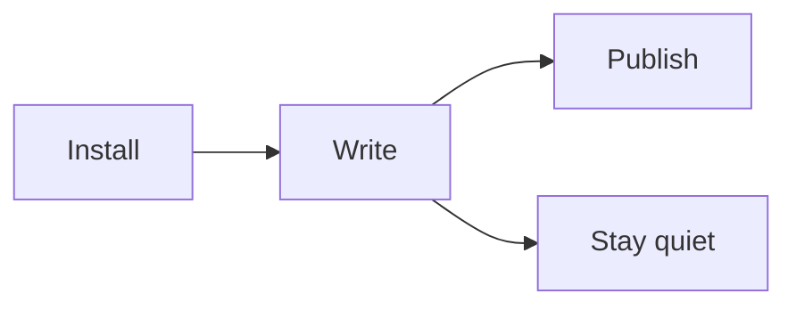

One page that exercises everything a theme has to carry, so you can judge the
typesetting before you install. The body is set at 18px on a 720px measure,
line-height 2.05, justified like a printed page.

## Text

Body text can carry *emphasis*, **strength**, ~~struck-through regret~~,
<mark>marked passages</mark>, `inline code`, and
[links](https://gohugo.io/). Chinese, 日本語，and English share one family:
IBM Plex Sans, subset per script and loaded only where a page needs it.

> Everything comes in threes. The theme keeps to three accents — vermilion
> for what responds, ink-green for what informs, amber for what glows — and a
> single ∴ where a section ends.

## Lists

1. Footnotes become Tufte-style margin notes on wide screens[^one] and fall
   back to endnotes on narrow ones.
2. The dark-mode toggle is a circular reveal, not a hard cut.
3. Archives carry the year as a ghost numeral in the background.

- three accent colors, no fourth
- IBM Plex, self-hosted and subset
- no third-party requests[^two]

## Code

Code blocks use class-based Chroma highlighting in a Catppuccin Macchiato
palette, with a copy button when enabled:

```python
def motto(n: int) -> str:
    """What can change the nature of a man?"""
    return "∴ " * n
```

```css
.post-content {
    font-size: 18px;
    line-height: 2.05;
    text-align: justify;
}
```

## Notation

Math renders only where a page asks for it (`math: true`), display style:

$$
\zeta(s) = \sum_{n=1}^{\infty} \frac{1}{n^s}, \qquad \Re(s) > 1
$$

and inline like \(\alpha \pm \beta\), without leaving the sentence. A long
formula scrolls sideways on narrow screens instead of breaking the measure:
\(e^{i\pi} + 1 = 0\).

## Diagram

Diagrams pick up the theme's palette and re-render when the theme flips
(`mermaid: true`):



## Figures

Images open in a lightbox when the page opts in (`lightbox: true`); with more
than one, arrows appear, and the caption under each figure travels with it.





## Table

| Element | Light | Dark |
| ------- | ------------------ | ------------------ |
| Links   | vermilion `#ad3e32` | vermilion `#e07061` |
| Meta    | ink-green `#2f6754` | ink-green `#648f77` |
| Mark    | amber highlight     | softer amber       |

## Details

Here it simply marks the end of a section.
Everything comes in threes.

---

A theme should disappear while you read. If you noticed it just now, that is
what the margin notes are for.

[^one]: Like this one — resize the window below 1280px and it returns to the endnotes.
[^two]: Fonts are the only self-hosted asset; no analytics, no trackers.
