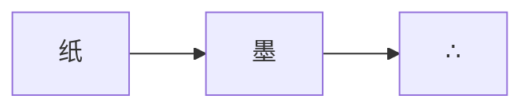

Sigil 的一切都成三：朱红标记会回应你的操作，墨绿承载信息，琥珀点亮高光，
段落结尾落一个 ∴。中文、日本語与 English 共用 IBM Plex Sans，
按脚本分子集、只在需要时加载。[^fonts]

宽屏上，脚注会变成 Tufte 式边注[^sidenote]；窄屏则收回文末。

## 列表

1. 宽屏边注、窄屏尾注
2. 圆形展开的暗色切换
3. 幽灵数字年份的归档

- 三个强调色，没有第四个
- IBM Plex，自托管并子集化
- 无任何第三方请求[^noreq]

## 代码

```python
def matte(r: int) -> str:
    return "∴" * r
```

## 公式

行内 $e^{i\pi} + 1 = 0$，以及：

$$\zeta(s) = \sum_{n=1}^{\infty} \frac{1}{n^s}$$

## 图表



[^fonts]: 字体是唯一自托管的资源；没有分析、没有追踪。
[^sidenote]: 就像这条——把窗口缩到 1280px 以下，它会回到尾注。↩
[^noreq]: 数学与图表按页面开启，未开启的页面一律不加载。
